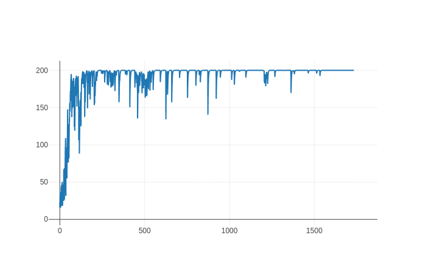

# REINFORCE

## About

REINFORCE is an on-policy Monte Carlo variant of a [policy gradient algorithm](https://proceedings.neurips.cc/paper/1999/file/464d828b85b0bed98e80ade0a5c43b0f-Paper.pdf). The agent uses its current policy to collect samples over an episode and then consumes the entire trajectory to update its parameters using the [policy gradient theorem](https://lilianweng.github.io/lil-log/2018/04/08/policy-gradient-algorithms.html#policy-gradient-theorem).

## Implementations

### Reinforce

Reinforce is `cogment-verse` minimal implementation of REINFORCE written using tensorflow. It is mainly designed as a entry point for people discovering the `cogment-verse` framework, as such, it is lacking a lot of bells and whistles: e.g. it only supports a simple multilayer perceptron architecture (MLP) making it only suited for low dimensionality environments.

The full implementation can be found in [`tf_agents/cogment_verse_tf_agents/reinforce/`](/tf_agents/cogment_verse_tf_agents/reinforce/)

#### Cartpole

_Experiment ran on 2021-11-22 on the current `HEAD` version of the code_

The run params were the following:

```yaml
cartpole_REINFORCE:
  implementation: "reinforce_training"
  config:
    class_name: data_pb2.RunConfig
    player_count: 1
    epsilon_min: 0.1
    epsilon_steps: 100000
    target_net_update_schedule: 1000
    lr_warmup_steps: 10000
    demonstration_count: 0
    total_trial_count: 10000
    model_publication_interval: 1000
    model_archive_interval: 4000 # Archive every 4000 training steps
    render_width: 256
    batch_size: 256
    flatten: True
    aggregate_by_actor: True
    framestack: 1
    replay_buffer_config:
      observation_dtype: float32
      action_dtype: int8
    num_input: 4
    num_action: 2
    model_kwargs: {}
    environment_type: gym
    environment_name: CartPole-v0
    learning_rate: 3.0e-4
    discount_factor: 0.99
    min_replay_buffer_size: 10000
    max_replay_buffer_size: 100000
    max_parallel_trials: 1
    agent_implementation: reinforce
```

This is a plot of the total trial reward against the number of trials with an exponential moving average over 50 trials.


