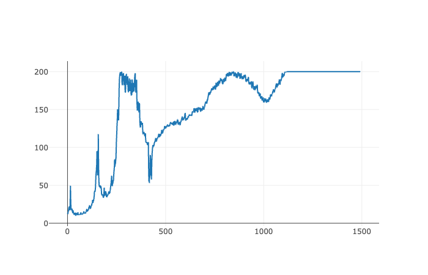

# Advantage Actor Critic (A2C)

## About

A2C is a on-policy, policy gradient algorithm. It was [introduced by OpenAI](https://openai.com/blog/baselines-acktr-a2c/) as a synchronous version of Asynchronous Advatage Actor Critic (A3C). A2C relies on an **actor** estimating the optimal policy distribution and a **critic** estimating the state-value function. A2C works by optimizing three losses:

1. the **critic loss** or **value loss** pushes the critic to make better estimations of the value function,
2. the **actor loss** pushes the actor to favor action that will lead to states having a better estimated value,
3. the **entropy loss** pushes the actor to pick more variety of action to favor exploration.

## Implementations

### _Simple_ A2C

SimpleA2C is `cogment-verse` very minimal implementation of A2C written using pytorch. It is mainly designed as a entry point for people discovering the `cogment-verse` framework, as much it is lacking a lot of bells and whistles: e.g. it only supports a simple multilayer perceptron architecture (MLP) making it only suited for low dimensionality environments, it also only supports non-stochastic policy.

The full implementation can be found in [`torch_agents/cogment_verse_torch_agents/simple_a2c/simple_a2c_agent.py`](/torch_agents/cogment_verse_torch_agents/simple_a2c/simple_a2c_agent.py)

#### Cartpole

_Experiment ran on 2021-11-10 on the current `HEAD` version of the code_

The run params were the following:

```yaml
simple_a2c_cartpole:
  implementation: simple_a2c_training
  config:
    class_name: data_pb2.SimpleA2CTrainingRunConfig
    environment:
      env_type: "gym"
      env_name: "CartPole-v0"
      seed: 12
    actor:
      num_input: 4
      num_action: 2
    training:
      epoch_count: 100
      epoch_trial_count: 15
      max_parallel_trials: 8
      discount_factor: 0.95
      entropy_coef: 0.01
      value_loss_coef: 0.5
      action_loss_coef: 1.0
      learning_rate: 0.01
    actor_network:
      hidden_size: 64
    critic_network:
      hidden_size: 64
```

This is a plot of the total trial reward against the number of trials with a exponential moving average over 60 trials.


