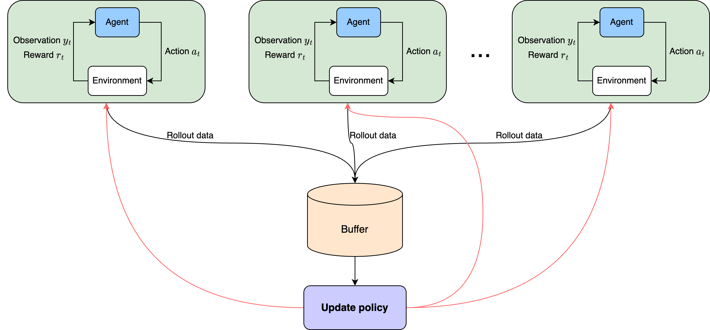
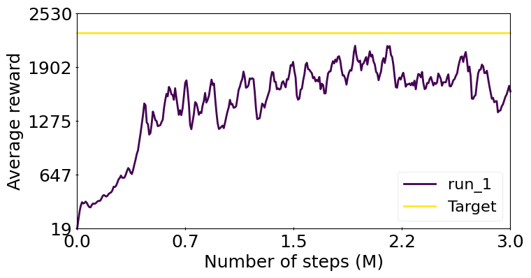

# Asynchronous Proximal Policy Optimization (APPO)

## About


[Proximal Policy Optimization (PPO)](https://spinningup.openai.com/en/latest/algorithms/ppo.html) is a reinforcement learning algorithm that optimizes policies for decision-making.
1. PPO balances exploration and exploitation using a trust region approach
2. Policy updates in PPO are based on maximizing an objective function that compares new and old policies
3. PPO works for both discrete and continuous action spaces
4. PPO is popular for its effectiveness and simplicity

We use an asynchronous version of Proximal Policy Optimization (APPO) in the cogment-verse platform to take advantage of its microservice architecture. This allows us to run multiple environments asynchronously, improving efficiency and performance. Figure 1 illustrates the overview of APPO architecture implemented in Cogment-verse.

<p align="center">
  
  <br>
  <em>Figure 1: Overview of APPO architecture in Cogment-verse.</em>
<p align="center">


## Implementation


- PyTorch-based implementation
- Supports continuous actions for Mujoco environment
- Utilizes Gaussian policy
- Compatible with Amazon SageMaker

The full implementation can be found in [`actors/appo.py`](/actors/appo.py).

## Example - Mujoco Hopper

To ensure reproducibility, the following parameters were used during the run:

```yaml
run:
  class_name: actors.appo.APPOTraining
  seed: 1
  num_epochs: 10
  num_iter: 100000
  epoch_num_trials: 4
  num_parallel_trials: 4
  learning_rate: 3.5e-4
  batch_size: 64
  buffer_size: 16384
  learning_starts: 1
  update_freq: 1
  num_rollout_steps: 2048
  max_training_steps: 3_000_000
  discount_factor: 0.99
  lambda_gae: 0.95
  device: cpu
  entropy_loss_coef: 0.00
  value_loss_coef: 0.25
  clipping_coef: 0.2
  num_hidden_nodes: 64
  grad_norm: 0.5
  logging_interval: 1
  is_vf_clipped: False
  state_norm: True
```

Note here that due to potential variations caused by the Mujoco environment's random seed, exact result reproducibility may not be possible. However, using the above-specified parameters and algorithms can help achieve similar performance in subsequent runs. Figure 2 shows the average rewards of the APPO on `Hopper-v4` environement. These results were obtained using the above-specified hyperparameters.

<p align="center">
  
  <br>
  <em>Figure 2: Performance of APPO agent on Hopper environment. Target value is defined based on Figure 1 in the PPO paper.</em>
<p align="center">

